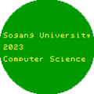
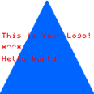
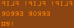
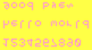

# 도형과 문자열을 이용한 로고 생성기

## 0. 프로젝트 개요


본 프로젝트는 C++ 기반으로 도형과 문자열을 결합한 로고를 자동 생성하는 프로그램입니다.  
사용자는 입력한 문자열에 대해 색상, 뒤집기 여부를 지정할 수 있으며, 문자열 위에 다양한 도형(사각형, 삼각형, 원)을 입히는 방식으로 그래픽 로고를 PNG 파일로 출력할 수 있습니다.  
텍스트 출력은 ANSI 색상 지원, 도형 그리기는 Bresenham 알고리즘과 flood fill 알고리즘을 통해 구현되었으며, 최종 출력물은 병합 기능을 통해 단일 이미지로 저장됩니다.

---

## 1. 주요 기능

- 소문자, 대문자, 숫자, 특수문자 등 다양한 문자 출력
- 문자열 뒤집기 옵션 (상하, 좌우)
- 도형 선택: 사각형, 삼각형, 원
- 텍스트 및 도형의 색상 지정
- 도형+문자 이미지 병합 및 PNG 출력
- ANSI 이스케이프 코드 기반 콘솔 색상 출력 지원
- 동적 메모리 관리 및 메모리 누수 없음 (Valgrind 확인 완료)

---

## 2. 사용 방법

### 🔧 컴파일

```bash
g++ main.cpp color.cpp ppng.cpp draw.cpp drawShape.cpp floodfill.cpp merge.cpp input.cpp printcolorful.cpp -lpng -o logo_maker
```

### ▶️ 실행 절차

1. 문자열 입력 (`\`으로 줄바꿈 가능)
2. 문자열 색상 선택 (1~8)
3. 문자열 뒤집기 여부 선택 (상하/좌우/그대로)
4. 도형 선택 (사각형/삼각형/원/없음)
5. 도형 색상 선택
6. PNG 파일 생성

---

## 3. 예시
 





---

## 4. 기술 요약

| 항목 | 설명 |
|------|------|
| 언어 | C++ |
| 출력 포맷 | PNG |
| 그래픽 처리 | Pixel 배열을 직접 구성하여 색상 지정 및 PNG 저장 |
| 이미지 병합 | 작은 이미지를 큰 이미지의 중앙에 overlay |
| 메모리 | 모든 동적할당 해제 완료 (Valgrind 확인) |

---


## 5. 제작자

- 20231604 정유연
- 20231624 한송이
